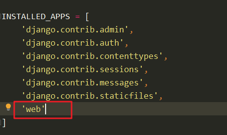

# Django框架

## 安装

pip install django（基于 python3）

## 启动

新建一个 django 工程后，再该目录下输入 python manerge.py runserver，后再浏览器中输入127.0.0.1:8000 后即可打开浏览器

## 新建app应用

python manage.py startapp web (app 应用名称)

+ 新建 app 后，需要在 setting 中添加该应用

+ 开发简单的 post 和 get 接口步骤：

  1、在 web/views 中添加接口内容

  

  2、在 url 中添加路径

  
