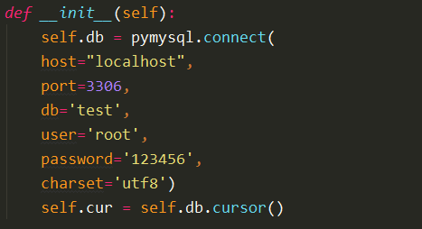
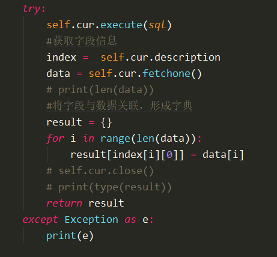

# Mysql简单操作

1、python3 安装 PyMySQL 库

pip install PyMySQL

2、数据库链接

host：数据库地址

port：端口号，默认为 3306

db：要连接的数据库名

user：用于连接数据库的用户名

password：密码

charset：字符集设置

db.cursor()：设置游标的位置

3、查询数据库数据

cur.execute(sql)：执行 sql 语句，查询数据库的数据

cur.fetchone()：匹配其中的一条数据

fetchall()：匹配所有的数据

cur.close()：关闭数据库

