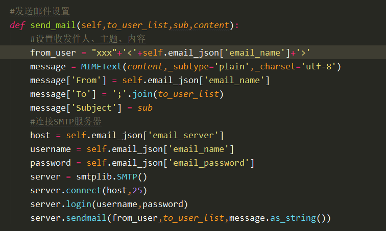

# SMTP

邮件发送设置

from_uer：发件人地址

message：需要 from email.mime.text import MIMEText  使用 MIMEText  

message['From']：设置发件人地址

message['To']：设置收件人地址

message['Subject']：设置邮件主题

host：SMTP 服务器地址

username、password：登录邮箱的用户名和密码

connect：连接 smtp 服务器

login：登录 smtp 服务器

sendmail：发送邮件

