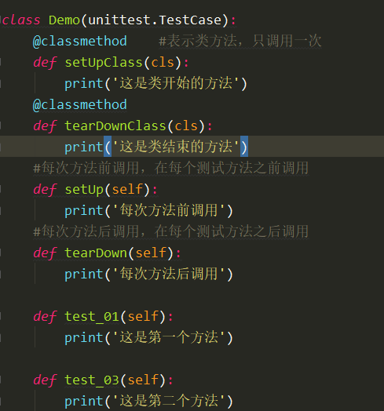

# unittest

## Unittest使用

1、新建类时需要继承 unittest.TestCase

2、setUP 函数：在每个 case 执行之前调用

3、tearDown 函数：在每次 case 执行后调用

3、test_01 和 test_03 为添加的 case：case  的命名必须以 test 开头

4、setUpClass 和 tearDownClass 是类的方法，在类的开始和结束被调用，只会被调用一次

## 运行case

1、unittest.main()

运行类中的所有 case

2、跳过某些测试的 case

@unittest.skip，写在要跳过的 case前

3、unittest.TestSuite：添加测试 case

​    suite = unittest.TestSuite()
​    suite.addTest(TestMethod("test_01"))      添加单个 case
​    suite.addTests([TestMethod("test_01"),TestMethod("test_02")])   添加多个 case
​    unittest.TextTestRunner().run(suite)

# 注意

上述 3 中添加的 case 中有被 @unittest.skip 修饰时，该 case 不会被执行

# case关联

当执行 case 的时候，如果当前 case 的参数需要使用到上一个 case 的返回值，需要进行关联，可以将该返回值进行 global 声明

# case执行顺序

1、unittest.main 根据测试 case 的命名进行升序执行
2、@unittest.skip() 跳过某个 case
3、使用容器时 unittest.TestSuite，根据添加的顺序进行执行

# HTMLTestRunner

1、新建文件为 HTMLTestRunner，从官网上下载内容将内容复制到此文件中

2、python3 使用此文件时需要修改，如下：

+ 将 94 行的 StringIO 修改为 io
+ 将 539 行的 self.outputBuffer = StringIO.StringIO() 修改为 self.outputBuffer = io.StringIO()
+ 将 631 行 print >>sys.stderr, '\nTime Elapsed: %s' % (self.stopTime-self.startTime) 修改为print(sys.stderr, '\nTime Elapsed: %s' % (self.stopTime - self.startTime))
+ 将 642 行 if not rmap.has_key(cls) 改为 if not cls in rmap 
+ 将 766 行 uo = o.decode('latin-1')  改为 uo = e
+ 将 772 行 ue = e.decode('latin-1') 改为 ue = e

3、执行测试

​    filepath = './report/htmlreport.html'     //测试结果记录
​    fp = open(filepath,'wb')
​    suite = unittest.TestSuite()
​    suite.addTests([TestMethod("test_01"),TestMethod("test_02"),Demo("test_03")])
​    runner = HTMLTestRunner.HTMLTestRunner(stream=fp,title= '接口测试报告')
​    runner.run(suite)
